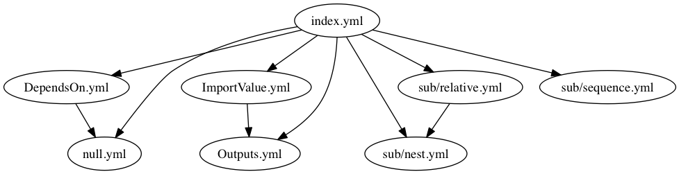

# cfn-deps



AWS CloudFormation のテンプレートファイル間の依存関係を [DOT 言語](https://ja.wikipedia.org/wiki/DOT%E8%A8%80%E8%AA%9E) の依存グラフとして出力する。

テンプレートファイル間の依存関係には CloudFormation の Outputs および ImportValue 関数を考慮する。
ただし、複雑な Outputs/ImportValue 名を使用している場合は検知できない。
(JSON.stringify が一致する Outputs/ImportValue に依存関係があるとしている)

```yaml
# Work
---
Outputs:
  Test1:
    Value: !Ref Res1
    Export:
      Name: !Sub ${Environment}-test-1
---
Resources:
  Test2:
    Paramenters:
      XXXId: !ImportValue
        "Fn::Sub": "${Environment}-test-1"
```

```yaml
# Not Work
---
Outputs:
  Test2:
    Value: !Ref Res1
    Export:
      Name: !Join [ "-", [ !Ref Environment, "test", 1 ] ]
---
Resources:
  Test2:
    Paramenters:
      XXXId: !ImportValue
        "Fn::Sub": "${Environment}-test-1"
```

また、手動で依存関係を明示したい場合はコメント部分などに `DependsOn: <relative_path_to_file>` を記述することで依存を追加できる

```yaml
# Work
---
Parameters:
  VpcId:  # DependsOn: other.yml
    Type: String
---
# other.yml
Resources:
```

## Install

```sh
$ npm install -g cfn-deps
```

## Usage

```sh
$ cfn-deps './**/*.yml' > deps.dot
```
